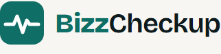
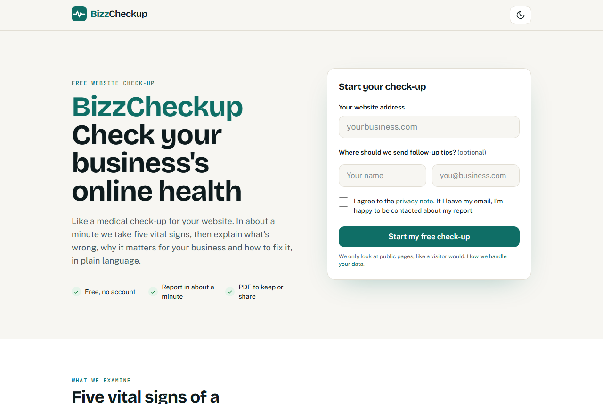
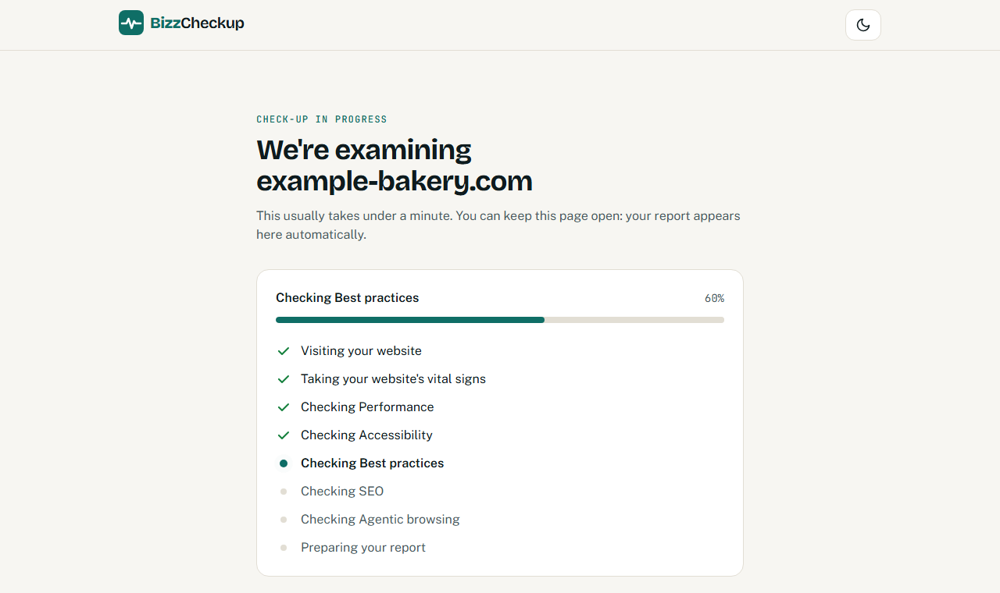
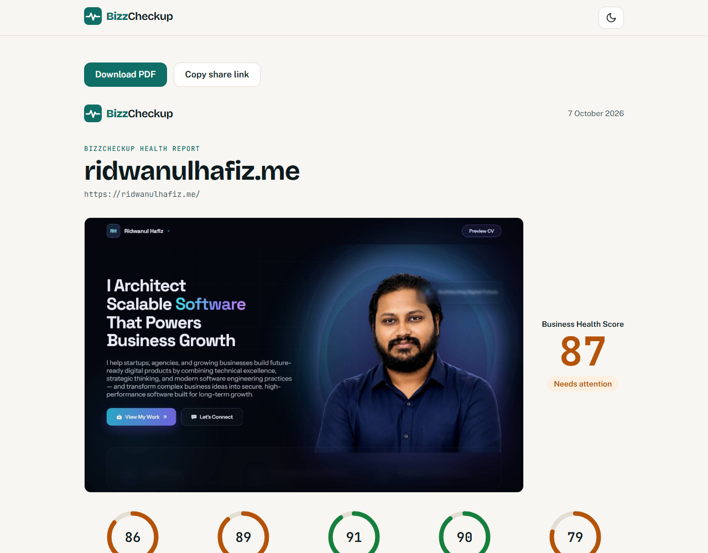
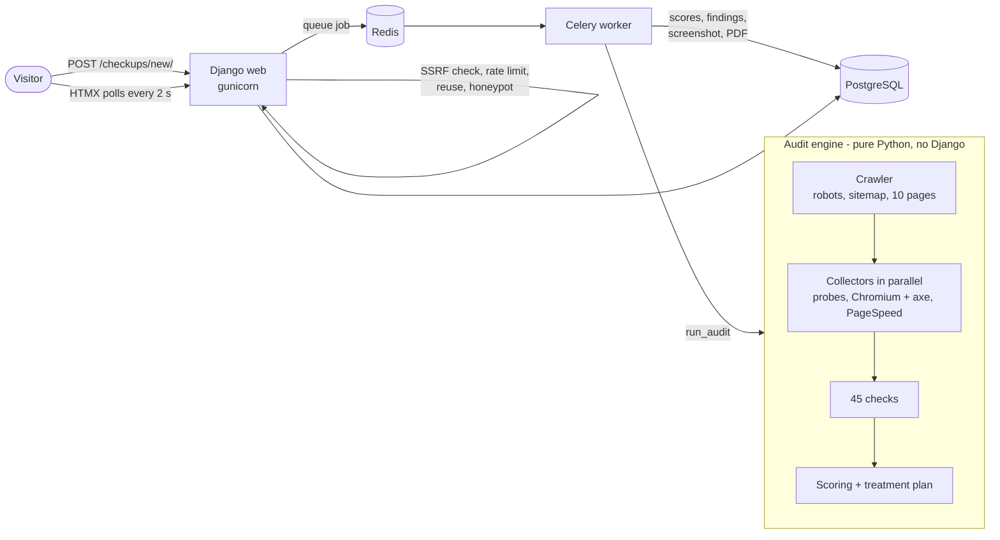

<p align="center">
  
</p>

<p align="center"><strong>Check your business's online health.</strong></p>

<p align="center">
  <a href="https://github.com/rdhafiz/bizzcheckup/actions/workflows/ci.yml"></a>
  
  
  
  <a href="LICENSE"></a>
</p>

BizzCheckup is a free website **health check-up for business owners**. Enter an address
and get a report like Google Lighthouse, written in plain business language: five
**vital signs** scored 0–100, a **Business Health Score**, a **treatment plan** with
quick wins first, and a closing page where the consultant offers to help.

| Landing page | Live progress | Health Report |
|---|---|---|
|  |  |  |

📄 **Sample report:** [ridwanulhafiz.me Health Report (PDF)](docs/sample/ridwanulhafiz.me-health-report.pdf)

## What it checks

45 checks in five vital signs. Every finding explains **why it matters for the business**
first, then **how to fix it**, with severity, effort, impact and the affected URLs.

| Vital sign | Examples |
|------------|----------|
| **Performance** | Google PageSpeed mobile and desktop scores, Core Web Vitals (LCP, CLS, INP/TBT, FCP; real-visitor data when available), page weight, unsized images, lazy loading, render-blocking files |
| **Accessibility** | axe-core scan by impact, image alt text, page language, heading order, form labels, link and button names |
| **Best practices** | HTTPS and the http→https redirect, mixed content, HSTS, CSP, nosniff, frame protection, Referrer-Policy, JavaScript errors, third-party cookies, outdated jQuery/Bootstrap/AngularJS/Lodash, doctype, charset, viewport |
| **SEO** | Titles, descriptions, one H1, canonical, robots.txt, sitemap, noindex, Open Graph/Twitter tags, valid JSON-LD, broken internal links, duplicate titles |
| **Agentic browsing** | llms.txt, AI crawlers in robots.txt (search vs training bots), firewalls/CDNs blocking AI agents, JSON-LD, page landmarks, named controls, content readable without JavaScript |

Full list with every pass/warn/fail rule: [docs/15-checks-reference.md](docs/15-checks-reference.md).

## How scoring works

1. **Check score (0–1):** from the worst finding (pass/info = 1, warn = 0.5, fail = 0).
   Checks with partial credit use the share of good pages or images. PageSpeed checks
   use Lighthouse's score.
2. **Category score (0–100):** the weighted average of the checks that ran. Skipped
   checks (for example, no PageSpeed key) are left out. **A high-impact failure caps the
   category at 89**, so one serious problem can't look "Healthy".
3. **Business Health Score:** the weighted average of the categories that were measured
   (Performance 25, SEO 25, Best practices 20, Accessibility 15, Agentic 15). The weights
   re-balance when a category is missing.
4. **Bands:** 🔴 0–49 *Needs urgent care* · 🟠 50–89 *Needs attention* · 🟢 90–100 *Healthy*.

## Architecture



- **Check-ups never run in a web request.** The web app only queues them, and the
  worker does the work, so many check-ups at once don't slow the site.
- **The engine** (`bizzcheckup/engine/`) has no Django imports. **Collectors** do all the
  network work, and **checks** are pure functions of the collected data, tested with
  local HTML.
- **Safety:** every request, including every redirect hop and every request headless
  Chromium makes, passes an SSRF guard. See [docs/17-security.md](docs/17-security.md).

More detail: [docs/ARCHITECTURE.md](docs/ARCHITECTURE.md) ·
[docs/14-audit-engine.md](docs/14-audit-engine.md) ·
[docs/16-health-report.md](docs/16-health-report.md)

## Quick start

**Development (Windows/macOS/Linux):** double-click `start.sh`, or run it in Git Bash or
a terminal:

```bash
git clone https://github.com/rdhafiz/bizzcheckup.git
cd bizzcheckup
./start.sh
```

It creates the virtual environment, installs the libraries and headless Chromium,
writes `.env`, starts PostgreSQL and Redis if Docker is running, builds the CSS, runs
migrations, and starts the worker and the server. Open <http://127.0.0.1:8000>.

**Everything in Docker:**

```bash
docker compose up --build
```

Open <http://localhost:8000>. CI checks on every push that this works from a fresh clone.

Step-by-step guide: [docs/02-installation.md](docs/02-installation.md).

### Configuration

Everything is set through environment variables (`.env` locally). The most important:

| Variable | Purpose |
|----------|---------|
| `DJANGO_SECRET_KEY` | Required. Long random string. |
| `DATABASE_URL`, `REDIS_URL`, `CELERY_BROKER_URL` | PostgreSQL and Redis |
| `PSI_API_KEY` | Google PageSpeed Insights key ([free](https://developers.google.com/speed/docs/insights/v5/get-started)). **Without it, speed checks are skipped and the report says so.** |
| `TURNSTILE_SITE_KEY`, `TURNSTILE_SECRET_KEY` | Optional Cloudflare Turnstile on the form |

All variables: [docs/06-configuration.md](docs/06-configuration.md).

### Make it yours

Every personal detail in the report (name, photo, services, contact links, call to
action) comes from [`branding.yaml`](branding.yaml). Fork the repo, edit that one file,
and `python manage.py check` tells you if anything in it is wrong.

## Adding a check

Write one class in the right `bizzcheckup/engine/checks/<category>.py`. It registers
itself, and nothing else needs to change.

```python
class SingleH1(Check):
    id = "seo.single_h1"
    category = Category.SEO
    title = "Main heading"
    weight = 5  # 1-10, importance within the category

    def run(self, ctx: AuditContext) -> list[Finding]:
        count = len(ctx.dom(ctx.homepage).css("h1"))
        if count == 1:
            return [self.passed("Your homepage has exactly one main heading.", WHY)]
        return [self.finding(Severity.WARN, f"Your homepage has {count} main headings.",
                             WHY, FIX, impact=Level.MEDIUM, urls=[ctx.homepage.final_url])]
```

Then add a test with a local HTML fixture (`tests/engine/checks/`). The rules every check
must follow are tested for all checks automatically (`test_all_checks.py`). Guide:
[docs/14-audit-engine.md#writing-a-check](docs/14-audit-engine.md#writing-a-check).

## Quality

```bash
ruff check . && ruff format --check . && mypy . && pytest
```

- **514 tests**, with no internet needed: fake DNS and fake websites, plus a real
  Chromium test and an **end-to-end test** that goes from the form through the worker to
  the PDF against a local site.
- **Ruff** (lint and format, security rules included) and **mypy** in strict mode.
- **GitHub Actions** runs everything on PostgreSQL and Redis, builds the Docker image,
  and starts the full `docker compose` stack.

## Deployment

The Docker image (`docker/Dockerfile`) runs both the web server (gunicorn) and the worker
(Celery, with headless Chromium included).

1. Run the image twice, as **web** and **worker**, plus PostgreSQL and Redis, as in
   `compose.yaml`.
2. Set `DJANGO_SETTINGS_MODULE=config.settings.prod`. That means DEBUG always off, HTTPS
   redirect, HSTS and secure cookies.
3. Set `DJANGO_SECRET_KEY`, `IP_HASH_SALT`, `DJANGO_ALLOWED_HOSTS`,
   `DJANGO_CSRF_TRUSTED_ORIGINS`, `DATABASE_URL`, `REDIS_URL`, `CELERY_BROKER_URL` and
   `PSI_API_KEY`.
4. Behind a reverse proxy, set `TRUST_X_FORWARDED_FOR=True` so rate limits see the real
   visitor IP. Only do this if the proxy sets that header itself.
5. **Isolate the worker's network.** It should reach the public internet, but **not**
   your internal services or cloud metadata. That's defence in depth on top of the SSRF
   guard (it covers DNS rebinding).
6. Run `python manage.py migrate`, then `python manage.py createsuperuser` for
   `/admin/`. Scale with `WORKER_CONCURRENCY` (default 3).
7. Run `python manage.py check --deploy` to confirm the security settings.

## Responsible use

- Only check websites you own or have permission to check.
- BizzCheckup behaves like a polite visitor. It identifies itself
  (`BizzCheckup/0.1 (+https://ridwanulhafiz.me)`), makes at most 2 requests to a site at
  a time, reads at most 10 public pages, and **respects robots.txt** when finding pages.
- It never logs in, submits forms or tries to break anything. It only reads what any
  visitor can see.
- Visitor IPs are stored only as salted hashes, and reports are private behind
  unguessable links. See the [security & privacy notes](docs/17-security.md).

## Roadmap

v0.1.0-alpha covers the full flow. Ideas for later:

- Email the report, and scheduled re-check-ups with comparisons over time
- User accounts and a history of check-ups
- More checks (Core Web Vitals per page, image formats, security.txt, broken external links)
- More languages for reports
- Larger crawls for bigger sites (currently capped at 10 pages)

## Documentation

Everything is explained step by step, for beginners, in [docs/](docs/README.md): setup,
the folder layout, every library and why it's used, Django's Model-View-Template,
the database, the engine, scoring, the report and PDF, security, testing, and the Python
concepts used along the way. Changes: [CHANGELOG.md](CHANGELOG.md).

## Licence

[MIT](LICENSE) © 2026 Ridwanul Hafiz. Third-party files keep their own licences: fonts
(SIL OFL, `static/fonts/`), axe-core (MPL-2.0, `bizzcheckup/engine/vendor/`) and htmx
(0BSD, `static/vendor/`).

---

<p align="center">Built by <a href="https://ridwanulhafiz.me">Ridwanul Hafiz</a> · Python · Django · Celery · Playwright · HTMX · Tailwind CSS</p>
